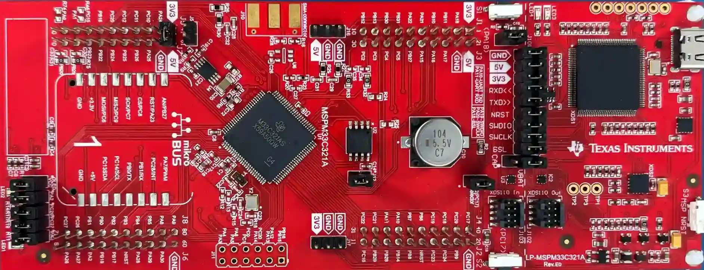

.. zephyr:board:: lp_mspm33c321a

Overview
********

MSPM33C321A microcontrollers (MCUs) are part of the MSP highly integrated, ultra-low-power 32-bit MCU
family based on the Arm® Cortex®-M33 32-bit core platform operating at up to 160-MHz frequency.
These MCUs offer high-performance analog peripheral integration, support extended temperature
ranges, and operate with supply voltages ranging from 1.62 V to 3.6 V.

The MSPM33C321A devices provide 1MB embedded flash program memory with built-in error correction
code (ECC) and 256KB SRAM with hardware parity option. These MCUs also incorporate a
memory protection unit, DMA, and a variety of peripherals including:

* Analog.

  * One 12-bit high-speed SAR ADC (HSADC) with 4 sequencers and up to 32 input channels.

  * Configurable internal voltage reference (1.4V, 2.5V) and external VREF support.

  * Post-processing blocks (PPB) with oversampling (up to 8x) and right-shift.

* Digital.

  * Multiple timer groups (TIMG) with alarm and capture/compare support.

  * Up to 3 GPIO ports (GPIOA, GPIOB, GPIOC) with interrupt support.

  * DMA controller with up to 16 channels.

* Communication.

  * UNICOMM (Universal Communication) peripherals supporting UART, SPI, and I2C modes.

  * Multiple UART instances with polling and interrupt-driven modes.

  * SPI with configurable clock polarity/phase and up to 32-bit word size.

  * I2C with controller and target modes, 7-bit addressing, standard (100 kHz) and fast (400 kHz) speeds.

Hardware
********

The LP_MSPM33C321A LaunchPad is a development platform for the MSPM33C321A microcontroller.
Zephyr uses the ``lp_mspm33c321a`` board configuration for building applications for this platform.

Details on the LP_MSPM33C321A LaunchPad can be found on the `TI LP_MSPM33C321A Product Page`_.
See the `MSPM33C321A Datasheet`_ for device specifications and the `MSPM33C321A TRM`_
for detailed register-level documentation.

Board Features
==============

- MSPM33C321A microcontroller with Arm® Cortex®-M33 core running at up to 160 MHz
- 1MB Flash memory with ECC
- 256KB SRAM with hardware parity
- On-board XDS110 debug probe with SWD interface
- User LEDs and push buttons
- Multiple expansion headers for BoosterPack ecosystem compatibility
- On-board 32.768-kHz crystal for LFCLK

Supported Features
==================

.. zephyr:board-supported-hw::

Connections and IOs
===================

LEDs
----

* **LED1** (red) = **PA0**

Push Buttons
------------

* **S2** (user button) = **PB21**

Default Zephyr Peripheral Mapping
----------------------------------

- UART (console): UNICOMM12 — TX on PA10, RX on PA11
- SPI: UNICOMM2 — SCLK on PB18, POCI on PB19, PICO on PB17, CS on PA2
- I2C: UNICOMM1_0 — SDA on PA0, SCL on PA1

System Clock
------------

The MSPM33C321A clock tree is driven by SYSOSC (32 MHz) through the system PLL:

- SYSOSC (32 MHz) → SYSPLL → HSCLK → MCLK (160 MHz)
- ULPCLK: 40 MHz ultra-low-power clock
- LFCLK: 32.768 kHz low-frequency clock

Serial Port
------------

The Zephyr console output is assigned to UNICOMM12 UART.
Default settings are 115200 8N1 with no flow control.

The serial port is accessible via the on-board XDS110 debugger's virtual COM port over USB.

Programming and Debugging
*************************

.. zephyr:board-supported-runners::

Applications for the ``lp_mspm33c321a`` board can be built and flashed using
OpenOCD with the on-board XDS110 debug probe.

Building
========

Follow the :ref:`getting_started` instructions for Zephyr application development.

For example, to build the :zephyr:code-sample:`blinky` application:

.. zephyr-app-commands::
   :zephyr-app: samples/basic/blinky
   :board: lp_mspm33c321a
   :goals: build

Flashing
========

OpenOCD is used to program the flash memory on the device via the on-board XDS110
debug probe using SWD transport. A custom OpenOCD build with MSPM33 support is
included in the workspace.

.. code-block:: console

   $ west flash

The application is written to on-chip flash memory at address ``0x10000000`` and
persists across power cycles.

If using OpenOCD from a non-default location, you can pass additional arguments:

.. code-block:: console

   $ west flash --openocd <path-to-openocd>/src/openocd --openocd-search <path-to-openocd>/tcl

Flashing with Multiple Boards
------------------------------

When multiple LP_MSPM33C321A boards are connected to the same host, identify each
board's XDS110 serial number:

.. code-block:: console

   $ lsusb -v -d 0451:bef3 | grep iSerial

Then flash a specific board by passing its serial number to the OpenOCD adapter:

.. code-block:: console

   $ west flash --cmd-pre-init "adapter serial <serial_number>"

For example, if ``lsusb`` reports ``iSerial 3 MG00DUT0``:

.. code-block:: console

   $ west flash --cmd-pre-init "adapter serial MG00DUT0"

If using OpenOCD from a non-default location, combine both options:

.. code-block:: console

   $ west flash --openocd ../openocd/src/openocd --openocd-search ../openocd/tcl \
         --cmd-pre-init "adapter serial MG00DUT0"

Flashing with Code Composer Studio
-----------------------------------

Programs can also be loaded into SRAM using TI `Code Composer Studio`_ (CCS) IDE.
Note that CCS uses SRAM-based loading only where we build the samples and load the zephyr.elf file
from the build directory to the TI Code Composer Studio (CCS) IDE in debugger mode.

1. Open CCS and create a target configuration for the MSPM33C321A using the
   on-board XDS110 debug probe.
2. Launch a projectless debug session (``Run`` > ``Debug Configurations`` >
   ``Code Composer Studio - Device Debugging``).
3. Connect to the MSPM33C321A core.
4. Load the ``build/zephyr/zephyr.elf`` file via ``Run`` > ``Load`` >
   ``Load Program...``.

Debugging
=========

You can debug an application using OpenOCD with the ``west debug`` command:

.. zephyr-app-commands::
   :zephyr-app: samples/basic/blinky
   :board: lp_mspm33c321a
   :goals: debug

This launches a GDB session connected to the MSPM33C321A via the XDS110 debugger,
providing full visibility into device state, registers, memory, and support for
breakpoints, watchpoints, and step-by-step execution.

Debugging with Code Composer Studio
-------------------------------------

TI `Code Composer Studio`_ can also be used for debugging. Load the
``build/zephyr/zephyr.elf`` file through the CCS debug session to get full
source-level debugging with register, memory, and peripheral views.

Recovery
========

The custom OpenOCD build included in the workspace provides device recovery
commands accessible through the OpenOCD telnet interface or command line:

- **Factory Reset** — restores device to factory state:

  .. code-block:: console

     $ <workspace>/openocd/src/openocd -s <workspace>/openocd/tcl \
         -f board/ti_mspm33_launchpad.cfg -c "init; mspm33_factory_reset; shutdown"

- **Mass Erase** — erases all flash memory:

  .. code-block:: console

     $ <workspace>/openocd/src/openocd -s <workspace>/openocd/tcl \
         -f board/ti_mspm33_launchpad.cfg -c "init; mspm33_mass_erase; shutdown"

References
**********

.. target-notes::

.. _TI LP_MSPM33C321A Product Page:
   https://www.ti.com/tool/LP-MSPM33C321A

.. _MSPM33C321A Datasheet:
   https://www.ti.com/product/MSPM33C321A

.. _MSPM33C321A TRM:
   https://www.ti.com/lit/ug/slau962/slau962.pdf

.. _Code Composer Studio:
   https://www.ti.com/tool/CCSTUDIO
